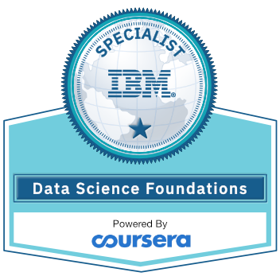

# Patrick Dolloso, IBM Data Science Foundations Specialist - Portfolio

[Click - Verify Certification](https://www.youracclaim.com/badges/ae5e2bc5-e3f7-46b8-9683-26cf6d14f331/public_url)

## Welcome!
* This is my Data Science repository to learn and apply my skills towards solving real world problems using the power of Data.
### Table of Contents
* [What's New?](#What's%New?)
* [Motivation](#motivation)
* [What is Data Science?](https://www.forbes.com/sites/gilpress/2013/05/28/a-very-short-history-of-data-science/#7feb74c355cf)
* [Projects](./projects/readme.md)

## What's New?
### Project:
* Chicago Public School Data Analytics using IBM Watson Cloud Analytics ([click!](http://nbviewer.jupyter.org/gist/patrickdolloso/eca2a273444dc2c083b0e5add952101c#Chicago-Public-School-Data-Analytics-using-IBM-Watson-Cloud-Analytics))  

## Motivation
* "For a long time I thought I was a statistician, interested in inferences from the particular to the general. But as I have watched mathematical statistics evolve, I have had cause to wonder and doubt… I have come to feel that my central interest is in data analysis… Data analysis, and the parts of statistics which adhere to it, must…take on the characteristics of science rather than those of mathematics… data analysis is intrinsically an empirical science… How vital and how important… is the rise of the stored-program electronic computer? In many instances the answer may surprise many by being ‘important but not vital,’ although in others there is no doubt but what the computer has been ‘vital." - John W. Tukey, 1962